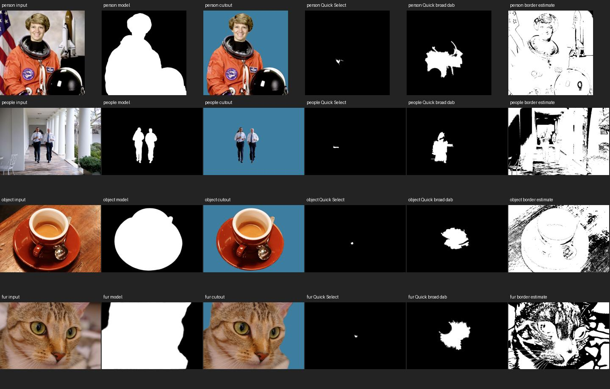
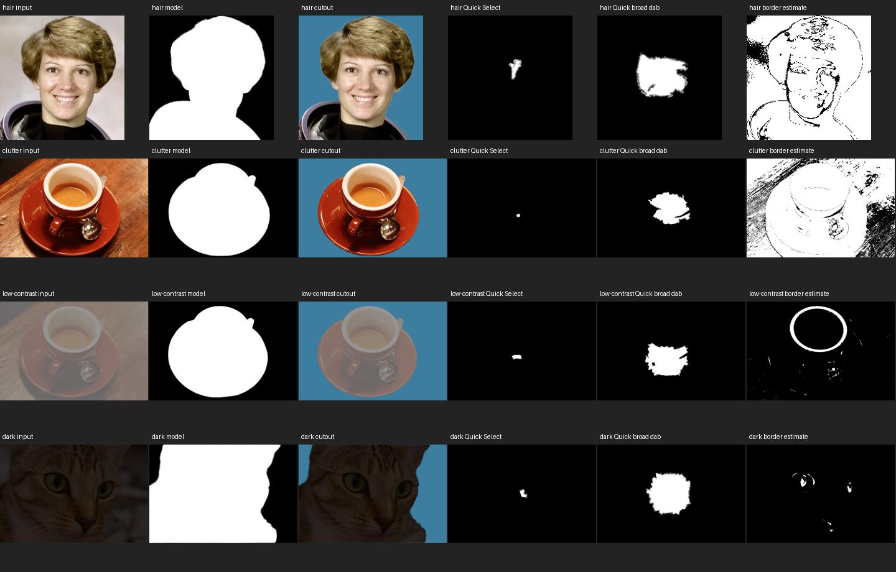
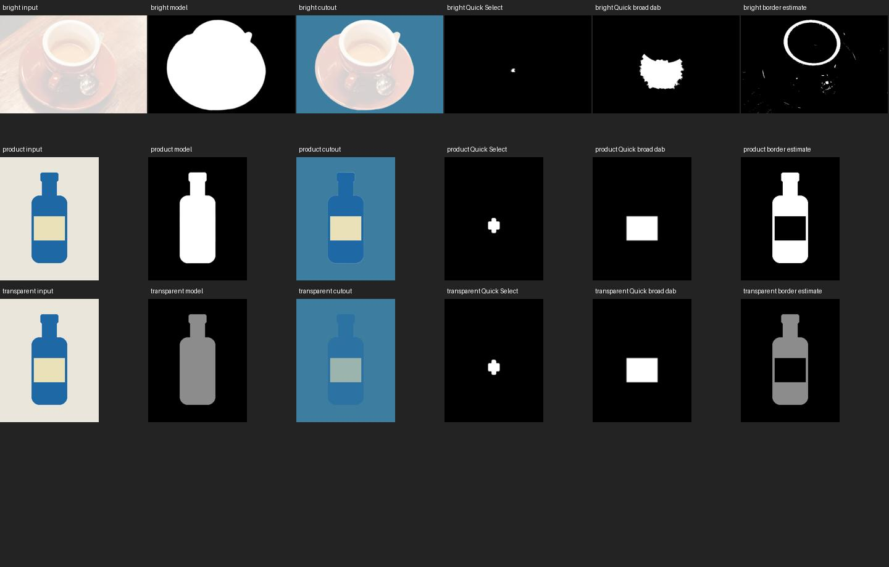

# M3 — local automatic subject masks

M3 adds **Select → Select Subject** and **Layer → Remove Background Automatically**.
Both copy the selected raster layer, run one local segmentation job, and show the
existing M1 preview with Accept/Discard. Accept uses the unchanged M0 transaction
for one selection or raster-mask history entry. Source pixels are preserved.
The existing **Remove Background from Selection**, Quick Select, selection tools,
and Refine Edge remain available. No ComfyUI connection or model provisioning is
required for M3. No M4 or later capability is included.

## Model and delivery decision

The shortlist was U²-NetP and BiRefNet-lite. U²-NetP was rejected at the delivery
gate: the inspected upstream code license alone did not establish explicit rights
to redistribute the separately hosted pretrained weights. It was not bundled.

BiRefNet-lite's [official weight repository](https://huggingface.co/ZhengPeng7/BiRefNet_lite)
explicitly declares MIT for the official weights; its
[code repository](https://github.com/ZhengPeng7/BiRefNet) is also MIT. The full pins,
source-file hashes, conversion versions, final artifact hash, input/output names,
and redistribution decision are in [model-provenance.json](model-provenance.json).
The upstream card and license are retained with the artifact. Weight rights were
checked independently of the code license before the model was added.

We converted the **official safetensors**, rather than using a mirrored ONNX file.
The developer recipe adapts the MIT
[CoderViking converter](https://huggingface.co/CoderViking/birefnet-lite-onnx/tree/dc06453148f01ef4131f17e9b791345e32e8ee78).
Per-tap GridSample replaces deformable convolution; static 512×512 avoids a large
dynamic intermediate graph. The FP32 export matched the reference model on the
recorded probe (maximum logit error 7.153e-5). FP16 storage reduced artifact size
to **94,377,615 bytes**. On the three initial photographs, FP16 versus FP32 binary
mask IoU exceeded 0.99994. This is conversion fidelity, not a quality benchmark.

**ONNX Runtime Web 1.22.0, single-thread WASM in one module worker** is the only
shipped runtime. This route ran in native WKWebView with useful masks and seconds
of latency. A service or native sidecar was unnecessary. No Python, WebGPU, CUDA,
Core ML, model manager, or additional execution provider ships. Runtime files
come from the pinned official npm package; hashes and its integrity string are
recorded. Trailing whitespace was normalized in the WASM loader and retained
model card; upstream and bundled hashes are distinguished in the provenance.
Runtime MIT and third-party notices are retained in the vendor folder.

## Contracts and authority

- Source: exactly one ordinary raster layer's **pixel** channel, tightly packed
  straight-alpha RGBA8 in the editor's existing sRGB8 representation. Groups,
  text, placed content, fill layers, mask-channel editing and unsupported targets
  are rejected with an actionable message. Remove Background additionally uses
  M0's existing editable raster-mask target validation.
- Preparation: composite RGB against neutral 128 **before** bilinear sampling;
  preserve aspect ratio with integer rounded letterboxing; normalize RGB with
  ImageNet mean/std. Store source rect, scaled width/height, padding and separate
  x/y scales. The only float input tensor is 3×512×512 (~3 MiB).
- Output: finite 1×1×512×512 float logits become sigmoid coverage, unletterboxed
  with explicit half-pixel bilinear projection. Coverage8 retains soft values,
  is multiplied by original alpha, and is zero outside the source/canvas. Fully
  transparent RGB cannot leak into inference or reveal pixels. Offset layers
  retain their explicit document origin.
- Provider output carries bytes, logical rect, geometric mapping, model/runtime
  identity and effective settings. It has no document, DOM, history or commit
  authority. The editor checks identity/mapping/size and copies output again.
- M1 owns queueing, cancellation, revision replacement, source validation and
  transient overlay. Repeating a request supersedes the old request. Quick Select
  and automatic selection share document session ownership.
- M0 alone commits. Selection replaces on Accept. Automatic Remove Background
  sends the same coverage to M0's `applyRasterMask`, using its existing intersect
  semantics, preserving an existing raster mask and vector-mask coexistence.
  Undo/Redo replay stored transaction bytes, without a model run.

Partially transparent source pixels constrain selection coverage. Applying that
coverage as a raster mask also multiplies the layer's existing alpha, so it may
further attenuate partially transparent edges. This is a conservative selection
contract, not optical transparency recovery or matting. Users can edit the mask.

## Bounds, loading and failure behavior

Source and canvas are each limited to **4,194,304 pixels**, axes 1–8192, source
origin ±8192. Larger inputs are rejected before expensive snapshots. Model input
is always 512×512; reconstruction is coverage8, at most 4 MiB per result. RGBA
input is at most 16 MiB; the editor keeps a separate immutable source snapshot.
No full-resolution float image is allocated. Existing M1 limits remain one
active execution, two queued, three live jobs, and 32 small terminal summaries.

The worker is created only on the first subject request. Model bytes have a fixed
length and SHA-256 check before session creation. Warm state expires after 30
idle seconds. Cancellation or runtime failure terminates the worker, loses warm
state and revokes Accept immediately. Subsequent requests create a new worker.
M1 releases its input, result, snapshot and overlay on terminal transitions.
Actual OS memory reclamation is controlled by WebKit, not guaranteed immediate.

Fixed tensor dimensions bound graph workload, but there is **no independently
enforced process-RSS cap**. Node/WASM evaluation used roughly 0.9–1.2 GiB RSS;
the native web-content process was observed near 2 GiB after repeated tests with
multiple documents and Web Inspector. These are whole-process observations, not
isolated model allocations. Low-memory machines may fail; such failures must not
commit history. Missing/corrupt assets, unavailable workers, runtime crashes,
inference errors and malformed outputs leave the original document untouched.

## Reproduce conversion and evaluation

Conversion is a developer-only operation. Use Python 3.12.14 and the pinned
`scripts/m3/conversion-requirements.txt`. Download the five files listed in
`sourceFilesSha256` from the official weight repository at revision
`aa62cd87eafb9cc43056d08ef3615a14628b831d` into one local directory. The exporter
checks every source hash before loading its local model code. Run:

```sh
python scripts/m3/export-subject-model.py --source /path/to/pinned-snapshot --out /tmp/birefnet-lite-512-fp16.onnx
python scripts/m3/decode-corpus.py /tmp/m3-corpus-raw
node scripts/m3/evaluate.mjs /tmp/m3-corpus-raw /tmp/m3-quality
python scripts/m3/render-evaluation.py /tmp/m3-quality
```

The Python environment is not bundled. Export logs report numerical parity and
the artifact SHA; dependency or exporter changes require renewed acceptance.
Ordinary CI uses deterministic provider fixtures plus bundled-asset integrity
checks. Real-model evaluation is separate and explicitly invoked.

## Quality review

The [versioned corpus](../../tests/fixtures/subject-corpus/v1/manifest.json) has
11 cases covering all requested categories: four independent photographs plus
seven correlated crops, photometric stress cases or synthetic products. Source
licenses, authors, derivation and PNG hashes are recorded. NASA/White House
photographs are public domain; coffee and cat are CC0. The synthetic transparent
bottle tests input alpha, **not real glass**. This is a small acceptance corpus,
not an independent natural-image benchmark.





The automatic model selects the full person and held helmet, both people, the
cup/saucer/spoon group, and the cat silhouette. It remains useful in the controlled
low-contrast, dark and bright transformations. Hair and fur boundaries are coarse:
fine wisps/whiskers are lost. The model chooses salient groups, not named objects;
the coffee example does not isolate only the cup. Letterboxing at 512 limits fine
detail on large or extreme-aspect images. Busy scenes and ambiguous foregrounds
still require manual review/refinement. No universal object understanding is claimed.

Baselines use the **production Quick Select computation** with a manually selected
foreground point: a small 9×9 dab and a broader circular dab (radius 10% of the
short side). The latter checks that the comparison is not solely a tiny-brush
effect. Both need more strokes to cover these subjects; the automatic result is
a more useful one-action starting mask. This does not compare against a fully
refined Quick Select session or suggest replacing that tool. A simple border-RGB
distance estimator is noisy on natural backgrounds and misses the product label.

Only the two synthetic cases have independent exact geometric/alpha labels.
Metrics use coverage ≥0.5 for IoU; boundary F has a two-pixel Chebyshev tolerance.
No-selection is an empty mask (IoU 0), not the editor's no-selection editing mode.

| Synthetic case | Model IoU | Small Quick dab | Broad Quick dab | Border estimate | Model boundary F |
|---|---:|---:|---:|---:|---:|
| Product | 0.99968 | 0.04803 | 0.27550 | 0.72428 | 1.000 |
| 55% alpha product | 0.99514 | 0.04803 | 0.27550 | 0.72428 | 1.000 |

Full per-case measurements, coverage MAE and masks are in `evidence/`. These
easy correlated synthetic scores cannot be generalized to photographs. See
[acceptance.md](acceptance.md) for native, offline, packaging and validation lanes.
