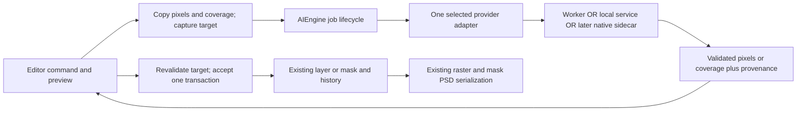
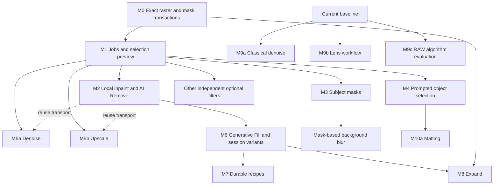

# PhotoSuite modernization roadmap

Audit date: **2026-09-27**. Status: **proposed plan; no modernization features implemented**.

Audited baseline: `be4f9e6a8f288f6ff27b7eea8481b69918698fcc` (PhotoSuite 0.9.14).
Started on clean `main`; planning branch: `codex/modernization-roadmap`.
`origin` is `https://github.com/joewolly/photosuite.git`. Read-only remote checks
found both fork and `eolix/photosuite` upstream `main` at that same commit. No
upstream remote was added. No CodeGraph index was present, so this audit used
source tracing, existing tests, and small in-memory probes.

## 1. Recommendation and scope

Build modern features around **immutable image requests and explicit editor
transactions**. Keep inference out of `Document`, the compositor, PSD
descriptors, and the synchronous Smart Filter render path. The first outputs
should be ordinary selections, raster masks, and raster layers. These already
have rendering, undo, and file-format infrastructure.

The recommended first implementation milestone is **M0: exact raster/mask
result transactions**. It gives plugins a useful, bounded insertion API and
establishes the same commit path later used by inference. It does not need a
model, download manager, or renderer change. Follow with one-job-at-a-time
lifecycle support and one optional backend. Prefer an already-running local
ComfyUI service for the first heavy inference integration; do not bundle its
Python environment or checkpoints. Compact in-process segmentation is a
separate, gated evaluation, not a prerequisite for shipping useful restoration.

This ordering deliberately avoids making every feature wait for a universal
model runtime. Existing selection preview, background removal from a manually
prepared selection, and bounded RAW improvements can ship independently.

**Firm exclusions:** full 16-bit/channel or 32-bit/HDR editing; a replacement
compositor; complete CMYK, Lab, or ICC workflows; Photoshop binary plugin ABI;
Adobe Camera Raw or Creative Cloud/Cloud Libraries clones; enterprise/cloud
collaboration; video; 3D; model training; and renderer rewrites justified only
by a proposed feature. Importing some such formats is not evidence of a
corresponding editing architecture.

The following sections distinguish **observed source behavior**, **proposed
design**, and **unverified product quality/performance**. No model inference,
GPU benchmark, packaged-app test, or Photoshop interoperability session was
performed during this audit.

## 2. Current architecture: implementation evidence

Paths below are relative links to this checkout. Line references and symbols
describe the audited SHA; revalidate them after upstream updates.

| Area | Actual path and observed behavior | Consequence |
|---|---|---|
| Document identity and state | [document.js](../src/document/model/document.js), `Document` at 197, `getRasterData` at 519, `generateLayerId` at 552, `setLayers` at 951. One object holds canvas, layer array/tree, selection, resources, composite, dirty state, and history. Layers use PSD `add.lyid`; current layer selection uses array indices. Constructor has no monotonic mutation revision or public session document ID. | Capture the actual document and stable target identity before an async operation. Never use the current tab or saved filename when a result returns. Validate imported/missing/duplicate layer IDs before exposing them. |
| Raster buffers | [buffer-utils.js](../src/engine/compositing/buffer-utils.js), `allocBuffer` at 196, allocates `Uint8Array`, rounding byte length to a multiple of four by default. [layer.js](../src/document/model/layer.js) stores an interleaved RGBA buffer plus a document-space `Rect`. [layer-system.js](../src/engine/layer-system.js), texture upload/readback uses `gl.UNSIGNED_BYTE`. | Editor-facing images are RGBA8; masks are coverage bytes. Logical dimensions, offsets, row layout, and actual payload length must be explicit. Internal alignment padding must not leak into an exact wire contract. |
| Composite/export | `Document.getRasterData()` calls `composite()` for dirty regions and reads back GL when needed; it normally returns the document's own buffer. [layer-compositor.js](../src/document/render/layer-compositor.js), `compositeLayerGpu` at 540, traverses groups, masks, clipping and effects, with CPU branches. | Copy a snapshot before transfer. A full composite is potentially expensive and not a detached immutable inference input by itself. Do not transfer the document's live backing store. |
| Selection | [selection-tools.js](../src/document/tools/selection-tools.js), `SelectTool.handleInput` at 178 accepts `actionKind: "setsel"` with `{rect, channel}`. It trims content, turns all-zero coverage into `null`, and pushes before/after selection history. Undo/redo are at 721/740. | Segmentation can return a byte coverage plane without adding a document type. Preserve soft coverage, origin, and replace/add/subtract/intersect semantics. Distinguish no selection from a full-canvas selection. |
| Existing object selection | [quick-select-session.js](../src/document/tools/quick-select-session.js), `createQuickSelectSession` at 90, `recomputeQuickSelectSelection` at 186, `seedObjectSelectionMask` at 256. Uses superpixels, foreground/background marks, graph cuts and boundary color refinement from [quick-select-graph-cut.js](../src/engine/compositing/quick-select-graph-cut.js). | Object selection is not a blank slate. Improve or supplement this path. Its `getLayerFingerprint` samples bounds/index and only the first RGBA pixel; it is unsuitable as an async result freshness token. |
| Raster/vector masks | [layer-masks.js](../src/document/model/layer-masks.js), `Mask`: `rect`, `channel`, outside `color`, density, feather, enabled state, clone and combine. Layer `d` is the raster mask; `add.vmsk` holds vector masks. [layer-effects-actions.js](../src/features/trackers/layer-effects-actions.js), `handleAddRasterMask` at 1125, and [layer-effects-history.js](../src/features/trackers/layer-effects-history.js), handlers at 456, provide undo. | Remove Background should attach/combine a raster mask, retaining source pixels and any existing mask. Outside coverage for an isolated subject must be zero. Cloning only `channel` is insufficient if feather/density/outside behavior is relevant. |
| Refine Edge | [text-warp-refine-dialogs.js](../src/ui/dialogs/text-warp-refine-dialogs.js), `RefineEdgeDialog` has trimap painting, before/after previews, alternate backgrounds and outputs to a new layer, mask, or selection (around 391–521). It calls `fill` from [content-aware-fill.js](../src/engine/compositing/content-aware-fill.js). | Reuse this interaction and output vocabulary. That `fill` is a trimap-based foreground/alpha estimator, not the main object-removal engine. Hair matting and color decontamination are different from semantic segmentation. |
| History | [document.js](../src/document/model/document.js), `HistoryEntry` at 48, `pushHistory` at 805; [tracker-registry.js](../src/features/trackers/tracker-registry.js), History calls the entry's originating tracker `undo`/`redo`. The visible stack is capped at 100 entries; snapshots retain pixels. | No history-engine rewrite is needed for one AI result. Add a bounded tracker/snapshot type. Do not equate `historyIndex` with a unique revision: branches, trimming, undo, and live previews break that assumption. Redo must replay stored pixels without inference. |
| Raster insertion | [layer-effects-stack-actions.js](../src/features/trackers/layer-effects-stack-actions.js), `chooseNewLayerInsertIndex` at 293 and Layer-via-Copy/Cut; `Layer.replaceLayerStack` handlers in [layer-effects-history.js](../src/features/trackers/layer-effects-history.js). Layer-via-Cut already commits source replacement and insertion together. | Reuse layer creation, group-aware insertion and stack snapshots. Do not send generated files through ordinary open/import and hope placement is exact. |
| Smart Objects | [document.js](../src/document/model/document.js), `registerLinkedFile`, `createSmartObjectLayer`, selected-layer extraction; [placed-layer.js](../src/document/model/placed-layer.js), `LinkedFileItem` owns encoded source bytes and a decoded raster cache. `lnk2`, `FEid`, `placedData` participate in PSD serialization. | A raster result can later be placed as an ordinary embedded image. No AI-aware Smart Object type is necessary. Its embedded image would be the generated output, not automatically the original editable inference recipe. |
| Smart Filters | [layer.js](../src/document/model/layer.js), `applySmartFilters` at 504 synchronously iterates PSD filterFX descriptors, allocates output, calls `FilterDefs.applyFilterToPixels`, blends, then replaces rendered pixels. [smart-filter-apply-tracker.js](../src/features/trackers/smart-filter-apply-tracker.js) handles preview/cancel/commit and undo. | An awaited model/server call cannot be inserted into this loop safely. Defer live AI Smart Filters. Keep deterministic existing CPU filters there; make AI operations normal commands producing retained result layers. |
| Filter definitions | [filter-registry.js](../src/features/filters/filter-registry.js) has names, menu groups, descriptors and script mappings. [filter-apply.js](../src/features/filters/filter-apply.js) installs pixel implementations; [filter-parameter-panel.js](../src/ui/filter-panels/filter-parameter-panel.js) supplies parameter UI. | Reuse menu/panel conventions, not necessarily descriptor execution. Add each neural operation independently behind the same inference boundary. A giant neural-filter framework is unnecessary. |
| Fill/healing | [paint-tools.js](../src/document/tools/paint-tools.js), `applyScriptedFill` at 295 routes content-aware Fill through selection + `sheal`; `compositeSpotHeal` at 1010 calls `runHealingBrushFill`. [healing-brush.js](../src/engine/compositing/healing-brush.js), entry at 296, performs patch matching/label optimization. Clone healing calls `solvePoissonFill`. Paint `finish`/undo/redo at 793–850 retain snapshots. [retouch-tools.js](../src/document/tools/retouch-tools.js) builds brush/patch workflows atop this. | Preserve fast classical repair. AI removal is another producer of a bounded patch, using the same selections and editor commit behavior. The empty `content-aware-fill.cancel()` at 105 is not working cancellation infrastructure. |
| Seam carving/canvas | [raster-transform.js](../src/document/render/raster-transform.js) uses [seam-carving.js](../src/engine/compositing/seam-carving.js) for content-aware resizing. [crop-tools.js](../src/document/tools/crop-tools.js), crop history at 513 and undo/redo at 551; [layer-translate.js](../src/document/model/layer-translate.js), `resizeDocumentCanvas` at 134 shifts layers, selections, guides and extra channels. | Outpainting can reuse canvas geometry, but must atomically commit canvas change plus generated pixels. It is not seam carving. Paths, slices, artboards, masks and negative offsets require explicit tests before broad document support. |
| Workers/WASM | [filter-band-runner.js](../src/features/filters/gallery/filter-band-runner.js) pools module workers, copies transferable buffers, includes band halos, and rejects pending jobs on errors. [filter-band-worker.js](../src/features/filters/gallery/workers/filter-band-worker.js) returns transferred output. [pixel-engine.js](../src/features/filters/gallery/pixel-engine.js) loads WASM; [font-registry.js](../src/fonts/font-registry.js) has a Typr worker. `src/wasm` contains blur, median, WebP encoding; vendor WASM includes codecs/shaping. | There is precedent for off-thread compute, not a general cancellable job service or ML runtime. Borrow message ownership/error patterns; do not turn the band runner into a model scheduler. |
| Desktop boundary | [lib.rs](../src-tauri/src/lib.rs), `read_file_raw` at 291 uses binary `tauri::ipc::Response`; `save_file` at 327 accepts a binary body; command registration at 559 is mainly files/fonts/dialogs/menus/plugins/resources/printing. [Cargo.toml](../src-tauri/Cargo.toml) has no inference dependency. | Rust is a good transport/process/model-file boundary. Avoid enormous JSON arrays/base64 and avoid loading a heavy inference engine into the editor process initially. |

### RAW is two pipelines, not one persistent RAW document

The traced import sequence is:

`format decode -> FileLoader.handle decoded image -> normalize(raw metadata)
-> rawdevelop dialog -> decodeRawImage -> developRaw -> Camera Raw raster filter
-> FileFormatRegistry.openFiles -> ordinary raster document`.

Evidence: [file-loader.js](../src/ui/shell/file-loader.js) at 562 dispatches RAW
metadata; [camera-raw.js](../src/document/formats/codecs/camera-raw.js) includes
RAF unpacking; [raw-functions.js](../src/engine/compositing/raw-functions.js)
normalizes metadata, unpacks sensor samples, applies supported DNG opcodes,
handles CFA patterns, orientation and camera matrices. `decodeRawImage` at
1047 retains `Float32Array` camera-native linear RGB. Bayer decoding uses the
existing `upsampleBlock` kernel; non-2×2 CFA uses `seamColorSample`. This is an
isolated place to compare a better Bayer method, not justification to replace
all RAW decoding or camera support.

[camera-raw-dialog.js](../src/ui/dialogs/camera-raw-dialog.js) decimates linear
RGB for preview, calls `developRaw` at full resolution on Open, applies the
raster Camera Raw filter, creates a document, then releases sensor-sized
buffers. `developRaw` writes byte RGB after white balance, camera transform,
highlight handling and tone mapping. A float temporary inside this import
pipeline does **not** imply floating-point document editing. Original RAW bytes
and develop settings are not attached as a reopenable RAW editing session by
this path.

[camera-raw-apply.js](../src/features/filters/camera-raw-apply.js) takes RGBA8,
makes float working copies, runs Basic/Curves/Mixer/Toning/Calibration/Optics/
Effects/Detail/Geometry, then returns bytes. `developOptics` at 590 currently
does distortion and vignette. `applyLuminanceNoiseReduction` at 705 blends
toward a 3×3 mean; color NR retains luminance while smoothing chroma. These are
concrete improvement opportunities, not absent features.

The separate Lens Correction path is richer: [lens-profile.js](../src/features/filters/lens-profile.js)
loads and matches the measured Lensfun database, interpolating distortion,
transverse chromatic aberration and vignetting. [lens-correction-apply.js](../src/features/filters/lens-correction-apply.js)
has warp, per-channel CA and profile corrections. Prefer surfacing/reusing this
existing filter after RAW development before expanding the RAW descriptor.
The database has its own CC BY-SA license; it is not the Lensfun C library.

### Plugins and scripting: useful primitives, incomplete transaction boundary

* [sidebar_plugins.rs](../src-tauri/src/sidebar_plugins.rs) validates manifests,
  canonicalizes entry/icon paths inside the plugin folder, and checks minimum
  app versions. [plugin-loader.js](../src/features/plugins/plugin-loader.js)
  reads entry/assets; [plugin-spec.js](../src/features/plugins/plugin-spec.js)
  inlines relative JS/CSS. [plugin-panel.js](../src/ui/panels/plugin-panel.js)
  uses opaque-origin `srcdoc` with `sandbox="allow-scripts"` for hydrated local
  plugins. Preserve that isolation.
* [plugin-host-ipc.js](../src/features/plugins/plugin-host-ipc.js) verifies the
  sending window against live plugin frames. Its commands are only `ping`,
  `getComposite` (full-resolution PNG) and `getSelectionMask` (coverage bytes +
  rect). Neither image reply carries a stable document ID/revision. New API
  versions should be additive and retain these existing reply shapes.
* [app-controller.js](../src/ui/shell/app-controller.js),
  `handleHostWindowMessage` at 658, also accepts legacy strings as scripts and
  ArrayBuffers as file opens. The explicit frame check applies to structured
  plugin requests; it is not applied in those two legacy branches. Do not
  describe the entire message surface as uniformly authenticated. Before
  extending writes, inventory legitimate embed/launch senders and add tests;
  use explicit legacy sender registration rather than silently breaking them.
* [script-engine.js](../src/features/scripting/script-engine.js) uses Acorn and
  an AST interpreter with Photoshop-style action dispatch. [script-host-context.js](../src/features/scripting/script-host-context.js)
  and [startup-wiring.js](../src/core/startup-wiring.js) control free-name
  bindings, including broad model/engine objects and builtins. This is evidence
  of intended restrictions, not a security proof of every object traversal.
  Plugins remain trusted to perform editing actions. Do not expose provider
  credentials, native commands or arbitrary network bridges as script globals.
* `suspendHistory` at 941 parses and evaluates its body; it does not implement
  rollback or history coalescing. An async transaction must not rely on that
  name. Preserve old script behavior and introduce a narrow command API, rather
  than changing interpreter Promise/await semantics across the application.

### PSD and serialization boundaries

[layered-codec.js](../src/document/formats/codecs/layered-codec.js) wires layered
formats; [psd-parser.js](../src/document/formats/psd/psd-parser.js) orchestrates
headers, resources, layers/masks and merged pixels. Its `writeHeader` at 62
always writes **depth 8, color mode 3 (RGB)**. [channel-image-codec.js](../src/document/formats/psd/channel-image-codec.js)
converts supported imported channels, including reducing 16-bit samples to
bytes. PSD/PSB support does not promise high-depth/color-mode preservation.

Ordinary generated raster layers and layer masks fit the current writer.
Selections are runtime state; persist a desired selection explicitly as an
alpha channel or layer mask. PSD's selected-layer resource is not a persisted
AI selection. History stacks and jobs are not serialized.

[psd-resource-parser.js](../src/document/formats/psd/psd-resource-parser.js),
`writeLayerInfoTag` at 1590, skips unrecognized additional layer keys.
[xmp-metadata.js](../src/document/formats/metadata/xmp-metadata.js) reads/writes
selected properties from `FIELD_MAP`; arbitrary prompt/model properties will
not survive just by assigning them to `doc.xmpMetadata`. An in-memory probe
confirmed both losses. Valid-signature image resource bytes can round-trip
through generic resource handling, but inventing a private resource ID without
format review is not an acceptable persistence strategy.

Therefore v1 AI results remain normal raster layers with **session-only**
recipe state clearly identified. A later, bounded namespaced XMP extension
must explicitly read/write a versioned recipe keyed to validated layer IDs.
It must survive save/reopen in PhotoSuite, tolerate missing/unknown versions,
and never execute embedded commands. Other applications may strip it; pixels
and masks must remain useful even then. Do not claim Adobe generative-layer or
AI Smart Filter interoperability. Retaining a seed is not a guarantee of
bit-identical regeneration across providers, models or GPU kernels.

### Architecture documentation needs qualification

[ARCHITECTURE.md](ARCHITECTURE.md) describes strictly downward imports and no
registries, but the actual model imports feature code (for example `Layer`
imports `FilterDefs`), `TrackerRegistry` exists, and startup installs bridges.
The cycle checker **does** pass with zero non-vendor cycles. Treat the
acyclic graph as a verified constraint, and the described layering as guidance
with existing exceptions. Do not introduce an unsolicited architecture cleanup.

## 3. Proposed shared architecture

### Small boundaries and ownership

Use the name `AIEngine` for an editor-independent request service if convenient;
its name matters less than its dependencies. Proposed locations, not added files:

* `src/features/ai/`: request validation, capability discovery, one-job queue,
  provider adapters, ephemeral result/recipe store and image preprocessing.
  No imports of UI controllers inside providers; no `Document`/`Layer` objects
  in requests. Prefer injected transport functions at startup.
* `src/features/trackers/ai-result-tracker.js`: snapshot creation/validation and
  the few permitted commits, using existing Document/Layer/Mask APIs. This is
  the only inference-related code with document mutation authority.
* `src/ui/` additions: command/dialog/panel integration, progress, preview and
  accept/discard controls, following existing widgets and event routing.
* `src-tauri/src/ai_transport.rs` only when the local service adapter ships:
  configured endpoint validation, bounded binary transfer and job events.
  Later native sidecar/model files belong behind this boundary, not in the
  compositor. Register a small explicit command set in `lib.rs`.

Do not pre-create abstract classes, backend families, a workflow editor,
generic plugin installer, or a model marketplace. Only implement capabilities
that an installed, tested adapter actually exposes.



### Minimal capability/request contract

This is a design sketch, not a new public API implementation:

```text
capabilities() -> [{ operation, inputLimits, outputKinds, settingsSchema,
                    supportsSeed, progressKind, cancellationKind,
                    locality, modelIdentity, runtimeIdentity }]
run(request, {signal, onProgress}) -> result

request = { schemaVersion, requestId, operation,
            image: {rgba8, width, height, alphaMode, colorEncoding},
            region: {documentRect, cropRect, inputToDocumentTransform},
            mask?: {coverage8, width, height, polarity},
            prompts?: {points, box, text}, settings }
result = { requestId, kind: coverage8 | rgba8, dimensions, outputTransform,
           bytes, effectiveSettings, modelIdentity, runtimeIdentity, seed? }
```

Add concrete operations as needed: `segment.subject`, `segment.prompted`,
`restore.inpaint`, `enhance.denoise`, `enhance.upscale`, `generate.masked`.
Outpainting initially composes a padded image/mask around `generate.masked`;
no distinct provider method is required unless a backend actually needs it.
Matting may later add `segment.matte`; saliency, object identity, and alpha
matting are not interchangeable capabilities.

The editor retains a separate target record: document session token, captured
document object, layer ID/object, canvas geometry, source mode, logical region,
copied selection, history-head identity, and source/target fingerprints. Do not
send file paths, full documents, history, EXIF/GPS, or credentials to inference.
Providers receive only the requested pixels/settings and return data. A
provider never chooses an insertion index or invokes an editing script.

**Image invariants:** top-left, row-major, tightly packed RGBA8 with explicit
straight alpha at the boundary; explicit display-space encoding (initially
sRGB-oriented, not a promise of arbitrary ICC fidelity). Convert/reject
unsupported input intentionally; do not silently relabel profiles. Preserve
original alpha separately when a backend consumes RGB. Selection convention is
0 excluded/255 included; removal mask convention must explicitly mean
0 preserve/255 regenerate. Map polarity per adapter. Crop, model padding,
downsampling and output resampling have an explicit geometric mapping back to
document coordinates; discarded image detail is not recoverable from that map.
Do not infer positioning from a PNG's size or a UI zoom factor.

### Job lifecycle, freshness and cancellation

States: `queued -> preparing -> running -> preview -> committed | discarded`,
with terminal `cancelled`, `failed` and `stale` outcomes. Start with one active
inference job per application and a bounded queue; no multi-GPU scheduler.
Provider progress can be stage-based or indeterminate. Do not fabricate a
percentage for an opaque model invocation.

* Clone before transferring; perform long preprocessing/hash work in a worker
  where necessary. Dispose model/result buffers explicitly; cap retained
  variations. Do not embed all intermediate tensors in undo history.
* Document close cancels/discards its jobs. Tab switches retain the original
  target and never redirect the result. Duplicate completions are idempotent.
  A cancelled/stale result may never commit, even if computation finishes later.
* Before Accept, require a live captured document, valid target layer, unchanged
  canvas/ROI and matching source/selection/target state. A monotonic mutation
  epoch maintained on commits/undo/redo is useful but **not sufficient alone**:
  live tool previews and legacy direct mutations exist. Also compare copied
  input/target fingerprints and refuse acceptance during an active gesture or
  preview. Do not reuse the quick-select first-pixel fingerprint or just
  `historyIndex`. If coverage of mutation hooks cannot be demonstrated, use a
  conservative full relevant snapshot comparison at acceptance, accepting its
  cost rather than silently accepting stale work.
* Initial stale policy: discard and rerun. Do not silently apply to a changed
  layer, merge conflicts, or resurrect closed documents. Later explicit import
  as a detached new image could be separate from Accept.
* Cancel stops queued work immediately and blocks commit synchronously. Worker
  termination can cancel an uncooperative local run (losing its warmed model).
  Service cancellation is best effort with a timeout and honest status; stopping
  an HTTP request does not prove remote GPU work stopped.
* ComfyUI versions differ: the audited server supports targeted interruption by
  `prompt_id`, while its route documentation also describes current-job
  interruption. Pin and test a supported version. Never send a global interrupt
  or clear someone else's queue to implement Cancel. On older/shared servers,
  delete only our queued ID if supported and discard a running result locally.
  See [server implementation](https://github.com/Comfy-Org/ComfyUI/blob/master/server.py)
  and [route documentation](https://docs.comfy.org/development/comfyui-server/comms_routes).

### Editor commit policy

1. **Selection:** route a normalized `{rect, channel}` through the existing
   `setsel` operation. Preview should be transient; Accept is one undo item.
2. **Remove Background:** build a complete mask before committing. Default to
   combining with the existing mask, preserving its effective coverage and
   keeping source pixels. Never mutate a referenced history mask after commit.
3. **Inpaint/generation/denoise:** create a new normal raster layer at exact
   document coordinates; name it clearly and retain the source. Use the original
   selection as an editable output mask where appropriate. Composite only the
   allowed patch so unselected pixels cannot drift with model output.
4. **Upscale:** first offer a new document at the actual output resolution.
   Increasing pixel dimensions inside the same canvas is not a full-image
   upscale. Same-document replacement or canvas resize requires a later explicit
   geometry transaction. Do not force a dimension-changing AI operation into
   the synchronous Smart Filter pipeline.
5. **Expand:** compute and preview the enlarged result off-document, then commit
   canvas geometry and inserted layer together. Compose existing crop/translation
   snapshots under one bounded tracker; do not chain unrelated undo entries.

Validation/preallocation happens before mutation. If a commit cannot complete,
restore its bounded snapshot. Undo removes/restores the result and affected
geometry/masks; redo restores the retained bytes, never contacts a provider.
PSD save/open must work without that provider or model installed. Direct layer
modification can be offered later as an explicit destructive choice; it is not
the default and is not needed for v1.

### Memory, privacy and persistence

A 6000×4000 RGBA8 image is **96 MB decimal**; a mask is 24 MB; a float RGB plate
is 288 MB. Input + result + document composite is already 288 MB, before source
layers, history, GL copies, encoding buffers, activations or model weights.
Two float RGBA plates add 768 MB. Tiling inference does not eliminate the final
editor buffer. Treat model file size, process RAM, GPU allocation and final
document memory as separate measurements.

Start with an explicit input/output pixel ceiling and byte budget, ROI plus
context for inpaint, reduced resolution for segmentation, and sequential
variations. Choose numeric shipping limits from M1/M2 hardware measurements;
until then use conservative test limits and reject oversize jobs before any
allocation/mutation. Do not quote an unmeasured universal RAM requirement.

Offline operation is the default: no model or runtime auto-download at startup,
no silent remote fallback, and no network request during document open/undo/
redo/save. Local service use is opt-in, with the destination visible. Only
configured loopback addresses are allowed initially; validate resolved addresses
and redirects in Rust. A localhost process or workflow can itself contact the
network, so offline acceptance also checks the chosen service/workflow. Do not
claim the editor's setting controls arbitrary external software.

Remote providers, when added, need explicit per-provider/per-job disclosure of
uploaded region/context, retention policy and cost; secrets stay in native
credential storage, never recipes, layer names, PSD or plugin replies. This is
a boundary for a later adapter, not a requirement to build account/billing UI
now. Plugins must not acquire remote-inference authority merely by requesting
pixels. Temporary uploads may remain in the external server's input/output or
history directories; explain retention and clean up only files/jobs owned by
the adapter, using supported APIs. Local-first does not mean zero disk traces.

Initial settings can use the existing [app-settings.js](../src/core/app-settings.js)
store for nonsecret provider configuration. Before bundled model downloading,
require a pinned manifest with source URL/revision, SHA-256, byte size,
input/output contract, conversion recipe, code/weight licenses, notices and
redistribution decision. Downloads need opt-in, resumable temporary files,
hash verification before atomic installation, disk checks, version coexistence
and user-visible removal. Keep weights outside `src/` and the application
bundle; never load an arbitrary executable/pickle from a model URL.

## 4. Runtime feasibility and first backend decision

| Boundary | Fit and acceleration | Memory, lifecycle and packaging | Decision |
|---|---|---|---|
| JS/WASM in a dedicated worker | Best fit for a compact, portable segmentation/enhancement graph. CPU baseline; WebGPU only after probing each Tauri webview and model's operators. Existing WebGL is not proof of WebGPU inference support. | Small runtime relative to Python, but weights/activations still share webview resources. Worker termination gives cancellation, not full native-process isolation. WASM/browser memory and transfer restrictions matter. | Evaluate second, for one compact segmentation model. Do not put diffusion or all models in the webview. |
| Inference inside a Rust/Tauri command | Can wrap native ORT/Core ML and use async commands, but native model loading/FFI faults or OOM can affect the app process. CPU off-thread does not imply safe cancellation. | Adds runtime libraries/FFI and platform build dependencies to the main app. GPU libraries have separate packaging constraints. | Use Rust for transport and supervision first; defer in-process heavy inference. |
| Bundled native sidecar | Stronger crash isolation; kill/restart independent of editor. Native ORT can expose CPU/CoreML/CUDA where compiled and supported; other runtimes can be substituted. | Executables per target/architecture, signed/notarized macOS helpers, Windows dependencies, Linux distributions, IPC and lifecycle ownership. Model packages still separate. | Good later packaged-offline option after one model proves value. No multi-runtime sidecar platform in v1. |
| User-run local inference service | Minimal app-package impact; GPUs and large model memory live outside the webview. ComfyUI already exposes jobs and image operations. Editor remains backend-independent. | Requires separate installation and compatible workflow/model; crashes isolate well. Version drift, cancellation ownership, CORS/auth and disk retention need an adapter. CPU generation may be impractically slow. | **First heavy backend:** optional ComfyUI adapter, one reviewed inpaint workflow and explicit user-provided model; Rust handles narrowly scoped transport. |
| Remote API | Can use same request/result contract; no local accelerator prerequisite. | Network failure, cost, upload privacy, terms and nondeterminism. Provider-specific errors/auth remain in adapter. | Later, optional. Never the automatic fallback or necessary for opening generated documents. |

External evidence: ORT documents [execution providers](https://onnxruntime.ai/docs/execution-providers/),
[WebGPU](https://onnxruntime.ai/docs/tutorials/web/ep-webgpu.html),
[CoreML](https://onnxruntime.ai/docs/execution-providers/CoreML-ExecutionProvider.html)
and [CUDA dependencies](https://onnxruntime.ai/docs/execution-providers/CUDA-ExecutionProvider.html).
These establish possible backends, not PhotoSuite compatibility or speed.
[ORT Web limits](https://onnxruntime.ai/docs/tutorials/web/large-models.html)
include the documented 4 GB WASM32 address limit and large-buffer restrictions.
[Threading options](https://onnxruntime.ai/docs/tutorials/web/env-flags-and-session-options.html)
must be checked against the packaged webview's isolation support. Tauri supports
[binary IPC and channels](https://v2.tauri.app/develop/calling-rust/) and
[target-specific sidecars](https://v2.tauri.app/develop/sidecar/).

**First adapter scope:** validate a configured local endpoint; inspect available
node/model capabilities; upload only a bounded image/mask; submit a fixed,
versioned workflow; correlate progress and output by job ID; return normalized
pixels; discard/cancel safely. ComfyUI has [inpaint encoding](https://github.com/Comfy-Org/ComfyUI/blob/master/nodes.py)
and [model upscale nodes](https://github.com/Comfy-Org/ComfyUI/blob/master/comfy_extras/nodes_upscale_model.py).
Its mask growth and latent-size cropping must be accounted for in the adapter.
Never accept arbitrary workflow JSON from a PSD or install custom nodes to make
a missing capability appear. Segmentation is not assumed to exist on a stock
ComfyUI installation. If the first inpaint workflow cannot meet isolation,
quality and license gates without a custom-node ecosystem, defer it and ship
the already-useful M0/M1 improvements; do not expand the foundation.

## 5. Feature-by-feature feasibility

The profiles below specify recurring behavior, so each feature does not need
to repeat identical platform and PSD caveats:

* **S — coverage output:** selection or raster layer mask, no new PSD type;
  selection persistence is explicit. One undo entry, source pixels retained.
  Pure JS editor integration works across the three desktop platforms; model
  availability is separately capability-gated.
* **R — raster result:** new layer/optional mask, or new document for changed
  resolution. Existing PSD pixels/masks remain independently usable; inference
  is not rerun on load/redo. Recipe persistence requires M7. Source retained.
* **F — existing deterministic filter:** current raster filter or ordinary
  Smart Filter where already supported; undo via its existing tracker. Any new
  descriptor fields need tests and an honest cross-app compatibility statement.
* **C — canvas transaction:** R plus atomic geometry/history snapshots. More
  integration than S/R and restricted initial document support.

All model-backed entries inherit the capability contract, platform gates,
artifact license gate in section 8 and tests in section 7. A feature being
feasible is not permission to bundle a particular checkpoint. Priorities are
sequencing judgments, not benchmark scores.

### Selection and background removal

| Feature / build decision | Reuse, new work and isolation | Output, dependencies, tests and major risks |
|---|---|---|
| **Selection preview/overlay improvements — build early** | Reuse Quick Mask, selection overlay and Refine Edge preview backgrounds. Add clearer source/coverage/accept controls; optionally offload existing graph-cut analysis to a worker. Small UI/session change, no model. | S; M1, independently useful. Test zoom/pan, offset masks, preview discard, fractional coverage and no history churn. Risk: promising responsiveness while graph construction still blocks; measure before claiming improvement. |
| **Remove Background from current selection — build early** | Reuse `Mask.combineWith`, mask reveal action and output preview. One fully prepared mask transaction; no separate editing infrastructure or inference needed. | S; M0. Test existing feathered/vector/raster masks, negative layer origin, hidden/locked targets, mask inversion and undo. Avoid destructive deletion or silent replacement of an existing mask. |
| **Select Subject — build after model gate** | Add a single automatic foreground/saliency provider using copied pixels and the common segmentation path; reuse `setsel`, combine modes and Refine Edge. Isolated provider + command. U²-Net is a compact candidate to evaluate, not an approved bundled artifact. | S; M1 + M3 model evaluation. Test multiple subjects, nonportrait objects, transparency, occlusion and boundaries against labeled examples. Saliency does not know the user's intended subject; show preview and correction. Keep “Select Subject” distinct from “select everything.” |
| **AI Object Selection — build after prompted segmentation gate** | Preserve existing box-seeded graph cut. Add point/box/positive-negative prompts to a provider such as a tested SAM 2 image adapter; reuse coordinate mapping and brush corrections. Cache embedding only by immutable source/model hash. | S; M1 + M4. Test prompt transforms, repeated edits, stale embeddings and multi-object scenes. SAM supplies object masks, not semantic primary-subject ranking. Native/ONNX conversion and interactive latency are unverified; do not add video support. |
| **Automatic Remove Background — build as composition** | Run approved subject segmentation, then the M0 mask transaction. Same model/session as Select Subject, no independent remove-background backend. | S; M3. Test alpha preservation and existing-mask intersection. Removing a background from a composite versus one layer must be an explicit source choice; initial scope is one raster layer. |
| **Interactive selection refinement — build incrementally** | Reuse add/subtract brush marks and graph-cut UI; support repeated prompted segmentation in one transient session. Optional embedding reuse stays inside provider. | S; M4. Test rapid out-of-order responses and final Accept creating one undo item. Risk: async responses replacing newer strokes; session sequence tokens must reject old responses. |
| **AI Refine Edge, hair/fur — conditional, later** | Reuse trimap, preview and mask outputs. Add one bounded matting provider around an existing coarse mask, preferably boundary ROI. Color decontamination, if offered, needs separate reconstructed RGB in a new layer. | S for alpha only, R for changed edge colors; M4 + M10 quality gate. Test fine strands, low contrast, transparent material, halos on black/white backgrounds. Segmentation alone does not solve mixed foreground/background color. Reject a model that needs huge full-frame tensors or unclear weight rights. |

### Restoration and enhancement

| Feature / build decision | Reuse, new work and isolation | Output, dependencies, tests and major risks |
|---|---|---|
| **AI Remove / object removal — build first heavy integration** | Current selection/brush defines erase coverage; reuse ROI extraction, context and result transactions. One inpaint provider/workflow returns a patch. Preserve classical Spot Heal. New work is adapter + preview, not a new retouch engine. | R; M0–M2. Test selected-region containment, feather edges, source alpha, edge-of-canvas and cancellation. May invent plausible texture or alter nearby content; inspect result and enforce unselected-byte preservation in editor. |
| **AI inpainting — build with Remove** | Same operation and workflow with explicit optional prompt/settings. A separate product label need not imply a separate subsystem. | R; M2. Same tests plus model input padding/polarity and prompt support. If a backend ignores prompts, capability discovery must say so. No live Smart Filter in v1. |
| **AI denoise — build after representative quality evaluation** | Shared enhancement request with a fixed-resolution image; optional selection/mask. Add one independently registered command/provider capability, not a framework. Existing RAW NR remains available. | R; M1 + M5a. Test flat noise versus fine texture, alpha, tiled seams, deterministic fixed fixtures and color drift. A diffusion sampler's “denoise” parameter is not evidence of photographic noise removal. Require a task-specific denoiser and its license review. |
| **AI upscale / super-resolution — build, bounded output size** | Shared enhancement request and existing file/document creation. Real-ESRGAN family or equivalent is an evaluation candidate; reuse the chosen service if it exposes an approved upscale model. | R to new document; M0/M1 + M5b, optionally reusing M2 transport. Test 2×/4× dimensions, seams, text/line art, alpha, memory preflight and actual resolution on save. Tiling limits inference activations but result/history memory grows quadratically. No automatic enlargement of all original layers. |
| **Face restoration — defer** | Could use the same ROI and R transaction later, but would also need face detection/alignment/compositing and a fidelity control. Technically isolated, with extra model dependencies. | R; M5a + separate quality/license decision. Test identity/detail drift and multiple faces. Do not prioritize a face-specific stack over general restoration; CodeFormer/InsightFace restrictions make popular combinations unsuitable as default bundles. No face-swap/identity product is planned. |
| **Scratch/artifact restoration — stage** | First reuse manual selection, Dust & Scratches, healing and inpaint. Automatic scratch detection would be a separate coverage producer; artifact denoising can be one enhancement model. | R or existing F; M2/M5a. Test thin genuine detail versus damage, scanned text, JPEG edges, and mask containment. Build manual masked repair; defer an automatic “restore any old photo” pipeline until one detector proves reliable and licensable. |
| **Content-aware fill improvements — build only measured wins** | Real path is `applyScriptedFill -> sheal -> runHealingBrushFill`; retain it. Consider bounded ROI, better preview, source-sampling control or worker execution using copied pixels. No AI model required. | R preview/new-layer option through M0/M1; existing destructive paint remains explicit. Test patch quality, sampling exclusion and progress/cancel. Do not replace patch matching with a neural dependency or treat the empty cancel function as usable. |

### Generative editing

| Feature / build decision | Reuse, new work and isolation | Output, dependencies, tests and major risks |
|---|---|---|
| **Generative Fill — build after inpaint works** | Same image/mask/context request plus prompt and supported settings. Reuse the proven adapter and R commit. Add prompt UI, result previews and explicit acceptance. | R; M2 + M6. Test asymmetric crops, feathered selections, prompt validation, output dimensions, failure and offline reopen. Model quality, service setup and terms remain the dominant dependencies. |
| **Prompt-based modification — bound to the same workflow** | Start with selected-region edits through Generative Fill. Whole-image modification may use a full-canvas mask only when the user chooses it. | R; M6. Test unchanged regions and clear source choice. Defer automatic semantic layer edits, text/vector reconstruction and instruction chaining: those require substantially different models and editor reasoning. |
| **Variations — build small** | Bounded preview list/result store; generate sequentially and keep only explicitly chosen outputs as normal layers. New grouping/selection UI, no persistent generation layer type. | R; M6. Test limits, memory eviction, switching variants and one-step acceptance. Do not place every failed/unused intermediate into PSD or undo history. |
| **Regenerate; seed/model/settings metadata — two stages** | Session recipe initially records effective settings, model/runtime/workflow identity and optional seed. M7 adds explicit namespaced XMP persistence keyed to layers and source hashes. | R; M6 then M7. Test deleted/transformed layers, unknown schema, metadata stripping, XML escaping and save/reopen. Recipe alone cannot reconstruct a lost pre-edit source; regenerate requires a matching live source or explicit reselection. No exact cross-hardware reproducibility claim. |
| **Generative Expand / outpainting — later, bounded** | Pad a copied composite, infer only exterior plus a small seam overlap, map output back and reuse crop/translation geometry. Commit canvas plus result together. No compositor change. | C; M0 + M6 then M8. Start with plain raster documents; reject artboards and unsupported geometry rather than approximating. Test top/left negative expansion, all four sides, masks, guides, paths, channels, slices and cancel/undo/redo. Main risk is coordinate/history correctness, not model dispatch. |

### Camera RAW and individual neural filters

| Feature / build decision | Reuse, new work and isolation | Output, dependencies, tests and major risks |
|---|---|---|
| **Better RAW/raster denoise — build bounded** | Improve the existing 3×3 detail stage with a tested edge-preserving method, or use M5a after development. Keep a default-off/versioned deterministic option if changing established rendering. | F for classical NR, R for AI; M9a independent of AI. Test edge retention, alpha, preview/full-res scale, old descriptor defaults and noise charts. AI after `developRaw` is developed-image denoise, not sensor-domain RAW denoise. |
| **Better demosaicing — evaluation only, then conditional** | A Bayer-only kernel behind `demosaicOrCopyRgb` can be compared without touching compositor or file engine. Keep fallback; do not rewrite proprietary RAW decoding or non-Bayer paths. | RAW import output remains ordinary 8-bit raster; M9c. Test all four phases, crop/orientation, odd/edge sizes, zipper artifacts, moiré, memory and real camera samples. Do not adopt a replacement without quality gain and source/algorithm license evidence. |
| **Lens correction / CA — build reuse first** | Surface the existing Lens Correction filter/profile match directly after RAW development. If integrating into RAW dialog later, factor only the shared evaluation functions and retain one warp/convention implementation. | F; M9b independent. Test known/unknown lens metadata, focal interpolation, channel alignment and avoiding duplicate DNG/profile correction. Existing Lensfun data is sufficient to start; no new lens database project. |
| **Highlight/shadow recovery — measured tuning only** | Existing linear decode and `developRaw` gain reconstruction are the bounded sensor-side hook. Raster Camera Raw already has highlights/shadows but cannot recover clipped bytes. | RAW import/F; M9c evaluation. Test unclipped versus saturated channels, exposure/WB and camera baselines. Reject “recover fully clipped detail” claims and a wide-gamut/HDR rewrite. |
| **Subject / sky masks for RAW — prefer normal masks after Open** | Subject uses M3. Sky requires a semantic sky-capable model; SAM/foreground saliency is not automatically sky identification. Apply ordinary masked adjustment layers after development. | S + existing adjustment layers; subject M3, sky conditional M10. Test sky through branches/buildings and source mapping. No persistent RAW mask session. Defer sky until a worthwhile model and license are identified. |
| **Local RAW adjustments — defer dedicated RAW stack** | Existing adjustment layers and masks deliver bounded local edits to the developed raster. A reopenable RAW session would require source retention, mask coordinates, processing versions and save semantics absent from current import. | Build post-development S/F composition, not a second RAW document engine. M0/M3. Tests cover mask alignment and ordinary PSD persistence. Dedicated sensor-stage local adjustments are disproportionate now. |
| **AI detail enhancement — use upscale/denoise first** | M5's independent commands cover the first useful cases. No hidden RAW preprocessing model chain. | R; M5a/M5b. Test invented detail and oversharpening. Defer sensor reconstruction unless it demonstrably improves the existing decoder within its isolated boundary. |
| **Depth estimation — optional later** | One model returns a normalized depth channel, converted to an ordinary alpha channel or grayscale layer. May later guide blur; no 3D subsystem. | S/R; M10 after one general backend proves useful. Test depth ordering, range normalization and transparent/reflective scenes. Monocular relative depth is not physical distance. Small Depth Anything V2 is a licensing candidate; larger variants have different terms. |
| **Background blur — build with masks before depth** | Use subject mask plus existing blur on a retained duplicate/background layer. No model beyond segmentation for first version; optional depth-aware kernel later. | S/F or R; M3, M10 optional. Test foreground halos and missing background behind foreground. A simple mask blur is useful but does not solve occlusion-aware lens simulation. |
| **Portrait relighting — defer** | Would need reliable foreground/geometry/light assumptions and quality validation. A separate provider could produce R, but neither depth alone nor current lighting filters demonstrate this workflow. | R if revisited; M10 + dedicated model/rights evaluation. Risk of identity/color changes and several interdependent models exceeds early payoff. |
| **Colorization — optional later, one filter** | Shared image request plus R output; preserve source and permit opacity/masking. No new document or neural-filter framework. | R; M10 with one approved model. Test monochrome scans, edge bleed and consistent colors; label inferred colors rather than claiming recovered originals. Weight rights and quality are unresolved. |

### Plugin/API extensions

| Extension / build decision | Existing/new boundary and dependencies | Acceptance, isolation and risks |
|---|---|---|
| **Document identity/capability discovery — build M0** | Add versioned `getDocumentInfo`/`getCapabilities`, session token, validated layer IDs and revision/freshness tokens. Keep old commands. | No PSD change for session IDs. Test identical filenames, closed/reopened documents and unsupported commands. Advertised capabilities must reflect actual installed adapter/model, not menu availability. |
| **Richer layer access / selection input-output — build narrow M0/M4** | Add read-only layer summaries and bounded raster ROI/mask read; validated `setSelection` through existing history. Copy/trim logical bytes. | S/R primitives across platforms. Test bounds, alpha, mask padding and wrong-document requests. Do not return live model objects, native paths or unrestricted layer internals. |
| **Exact raster insertion / history-safe transaction — build M0** | Typed result insertion with explicit target, rect, dimensions and copied bytes; use group-aware stack commit. Add narrowly defined batch only for known combined operations later. | R; one undo item, exact coordinates, source unchanged, redo without plugin. Reject malformed/oversize data atomically. This is not general arbitrary-script rollback. |
| **Progress/cancellation / AI backend access — M1 then capability extension** | Request IDs and job events share internal job lifecycle. A plugin may request an approved operation under host provider/privacy policy. | Host owns cancel and acceptance; unloading frame revokes response/commit authority. No credential or arbitrary HTTP/shell access. Exercise unknown/malicious sender, replay, disconnect and cancel races. |
| **Filter invocation — incremental whitelist** | Existing actions/scripts already invoke filters. Add structured invocation only for a tested subset with parameter validation and declared selection/Smart Object behavior. | F; after M0. Test unsupported descriptors and history. Do not clone Photoshop ABI, expose `FilterDefs` wholesale or promise async Smart Filters. |

## 6. Small, independently shippable milestones

Effort descriptions identify touched subsystems, not calendar promises. Each
milestone has its own release value and stop condition. Stop at a failed gate;
do not silently accumulate its deferred scope into the next milestone.

### M0 — Exact result transactions (recommended first)

* **Scope:** internal snapshot/target validator, exact raster insertion,
  selection update, mask combination; additive plugin capability/document-info
  commands and a minimal example sending a prepared result. Each operation is
  separately reviewable. Background removal from an existing selection is the
  built-in user-facing proof.
* **Non-goals:** model/runtime, downloads, generic transactions, arbitrary script
  rollback, canvas expansion, durable recipes or broader plugin trust redesign.
* **Architecture/sequence:** inventory message senders and preserve registered
  legacy paths; define typed input/limits/session IDs; implement pure validation;
  add bounded tracker snapshots and group-aware insertion; wire host commands;
  document exact byte/coordinate semantics. Complete objects before committing.
* **Tests:** real selection/history/layer paths; 3×5 padded mask; nonzero and
  negative layer origins; existing masks; duplicate names; wrong token; locked
  targets; malformed/oversize bytes; undo/redo after layer reorder; save/reopen.
* **Acceptance:** prepared patch lands pixel-exactly, one accepted operation is
  one undo item, cancel/failure leaves bytes/history unchanged, redo needs no
  plugin, mask removal preserves original pixels, old plugin example still works.
* **Dependencies:** current passing baseline only. **Risks/stop:** undocumented
  sender/target behavior; do not ship writes until sender and stale-target tests
  pass. No global model refactor to solve ID validation.

### M1 — Job lifecycle and responsive selection sessions

* **Scope:** one-job queue, request IDs, progress/error/cancel, transient preview,
  freshness checks and byte budgets. Exercise it with one existing graph-cut
  computation in a dedicated worker where feasible, plus a deterministic fake
  provider in tests. Improve selection overlay/accept/discard behavior.
* **Non-goals:** universal task scheduler, GPU runtime, model catalogue.
* **Architecture/sequence:** copied snapshots -> small provider contract ->
  state machine -> worker/error recovery -> UI -> M0 acceptance adapter.
  Capture relevant state at submit and revalidate at Accept.
* **Tests:** cancel/complete races, stale strokes, history branching, tab switch,
  close, worker crash, duplicate callbacks, buffer detachment and queue limits.
* **Acceptance:** no stale/cancelled result commits; UI remains usable; preview
  creates no history until Accept; classical selection still works offline.
* **Dependencies:** M0. **Risks/stop:** copying/graph building on UI thread may
  dominate; measure and narrow worker work, not rewrite rendering.

### M2 — One local inpainting backend and AI Remove

* **Scope:** optional already-running ComfyUI, one reviewed fixed workflow,
  bounded raster ROI/mask, user-provided checkpoint, preview and new-layer commit.
* **Non-goals:** installer, Python bundle, custom-node manager, arbitrary workflow
  editor, remote service, bundled generation model, automatic whole-photo repair.
* **Architecture/sequence:** pin/test service version and checkpoint terms;
  add configured loopback Rust transport; capability/preflight probe; binary
  upload/job/progress/result path; verify padding/polarity; wire Remove UI.
* **Tests:** fake HTTP/job service in CI; live pinned workflow on supported
  platforms; timeout, disconnect, wrong result, service crash, shared queue
  ownership, unselected-region preservation, PSD reopen with server stopped.
* **Acceptance:** one selected object/region can be replaced on a new layer,
  accepting/undoing requires no structural editor change, offline use has no
  outbound requests, cancellation never interrupts another client's job.
* **Dependencies:** M0/M1 and explicit supported workflow/model record.
  **Risks/stop:** setup burden/quality/license. No claim of CPU generation
  usability or Apple/NVIDIA acceleration without measured evidence.

### M3 — Automatic subject masks and Remove Background

* **Scope:** evaluate, then integrate one automatic foreground model with the
  existing S path. Trial a compact ONNX model in a worker; benchmark native/local
  service only if the compact route fails. One runtime path ships, not all three.
* **Non-goals:** semantic detection zoo, universal WebGPU support, model manager,
  hair reconstruction or sky detection.
* **Architecture/sequence:** pin source/weights/license/conversion; measure on
  minimum machines; implement normalization/resizing/mask projection; connect
  Select Subject and mask combination; retain manual correction.
* **Tests:** quality corpus plus odd/large sizes, soft alpha, transparency, scale,
  cancel, memory and packaged-webview CPU behavior on macOS/Windows/Linux.
* **Acceptance:** corpus improvement over classical selection with acceptable
  latency/memory; one-click mask, editable edges and source preserved; weights
  can be used offline and distributed only when explicitly cleared.
* **Dependencies:** M0/M1, not M2. **Risks/stop:** unresolved weight rights or
  webview resource cost. Ship M0's manual-mask workflow if this gate fails.

### M4 — Prompted object selection and refinement

* **Scope:** point/box prompts and positive/negative corrections with one
  approved prompted model; shared preview/selection application.
* **Non-goals:** video tracking, semantic subject ranking, automatic matting.
* **Architecture/sequence:** evaluate SAM 2 image path/runtime conversion ->
  provider capability -> embedding cache ownership -> prompt UI -> brush refine.
* **Tests:** prompt coordinates across zoom/crop, changing source/model, rapid
  corrections/out-of-order results, multiple objects and one-step Accept.
* **Acceptance:** corrections produce useful masks interactively on declared
  hardware and never replace newer user strokes; classical box selection remains.
* **Dependencies:** M0/M1; M3 shares utilities but is not logically required.
  **Risks/stop:** model weight license may be clear while conversion/operator/
  runtime support is not. Defer if full embedding exceeds budget.

### M5a — One photographic denoise command

* **Scope:** one fixed-resolution model; selection optional; new-layer result.
* **Non-goals:** RAW sensor denoise, face restoration, multi-model pipelines.
* **Architecture/sequence:** choose licensed task-specific candidate -> quality
  comparison -> provider capability -> preview/strength -> retained output.
* **Tests/acceptance:** flat-field noise decreases without unacceptable texture,
  edge or color damage on the agreed corpus; unchanged alpha; no tile seams;
  offline PSD reopen and byte-exact undo/redo.
* **Dependencies:** M0/M1 and a proven backend capability (reuse M2 if suitable).
  **Risks/stop:** no approved denoiser selected by this audit; do not substitute
  generative image-to-image strength for a validated denoise operation.

### M5b — Bounded super-resolution to a new document

* **Scope:** one approved upscale model, explicit output dimensions and memory
  preflight; original document remains available.
* **Non-goals:** resizing every layer/Smart Object, unrestricted gigapixel output.
* **Architecture/sequence:** model/runtime record -> tiling/alpha policy -> output
  limit -> preview -> new-document creation using existing raster import path.
* **Tests/acceptance:** correct 2×/4× sizes and alpha, no visible tile joins on
  corpus, useful improvement against ordinary resampling, predictable rejection
  of over-budget results, reopened files have real output resolution.
* **Dependencies:** M0/M1; M2 transport can be reused independently of M5a.
  **Risks/stop:** final buffer RAM and hallucinated detail; cap output before
  inference, not after expensive allocation.

### M6 — Generative Fill, selected-region modification and variations

* **Scope:** prompt UI, bounded sequential variants, explicit regenerate in the
  current session and retained effective settings.
* **Non-goals:** persistent special generative layers, remote accounts, outpaint,
  exact seed reproducibility or automatic semantic document restructuring.
* **Architecture/sequence:** extend M2 request/UI only where capability supports
  prompts -> retain recipe/source hash -> variant previews -> accept via M0.
* **Tests/acceptance:** model returns at expected coordinates; unselected pixels
  stay unchanged; variant limit enforced; session regenerate detects changed
  sources; undo/redo and opening PSD work with service stopped.
* **Dependencies:** M2. **Risks/stop:** each generation recipe is a model contract;
  unsupported settings must be rejected, not silently ignored.

### M7 — Durable generation recipes without a new file format

* **Scope:** a versioned PhotoSuite XMP namespace for minimal per-layer recipes,
  with opt-out/strip behavior for private prompts. Pixel fallback is mandatory.
* **Non-goals:** replaying history, embedding model weights, persisting all
  variations/source tensors, Adobe generative descriptor compatibility.
* **Architecture/sequence:** define schema and source-reference limitations ->
  explicit XMP reader/writer extension -> attach by validated layer IDs -> UI
  provenance/regenerate availability -> unknown-version/stripped metadata handling.
* **Tests/acceptance:** encode/decode round-trip, malformed/oversize XML and
  escaping, renamed/duplicated/deleted layers, PSD/PSB, missing recipe/provider,
  no automatic execution or network on open. Cross-app strip test preserves pixels.
* **Dependencies:** M6. **Risks/stop:** generic XMP passthrough is not present;
  if change spreads into a format rewrite, defer persistence and label recipes
  session-only. Missing source means explicit rerun-from-current-source, not a
  false promise to reconstruct the original generation.

### M8 — Generative Expand for plain raster documents

* **Scope:** one bounded canvas expansion with retained original layers and a
  generated exterior/seam layer committed atomically.
* **Non-goals:** artboard expansion, arbitrary documents with unsupported
  geometry, automatic multi-step giant panoramas.
* **Architecture/sequence:** define old/new coordinate mapping -> off-document
  padded preview -> composite crop/translation snapshot + result tracker -> UI.
* **Tests/acceptance:** four sides and negative offsets, supported paths/masks/
  channels/guides/slices, one undo restores exact geometry/content, redo uses no
  provider, cancel never resizes canvas, PSD reopen at new dimensions.
* **Dependencies:** M0/M6. **Risks/stop:** if supporting a geometry case requires
  broad transformation changes, reject that case explicitly in v1.

### M9a — Better classical detail denoise

* **Scope:** one measured edge-preserving improvement to Camera Raw raster detail.
* **Non-goals:** sensor model, new RAW document, universal color corrections.
* **Architecture/sequence:** baseline charts -> compare bounded kernel ->
  default/version compatibility decision -> existing descriptor/panel integration.
* **Tests/acceptance:** no-op byte identity; old descriptor behavior is preserved
  unless explicitly versioned; less noise with retained edges; alpha intact;
  acceptable full-res cost and consistent preview interpretation.
* **Dependencies:** none of the AI milestones. **Risks/stop:** bigger neighborhood
  kernels may block previews. Do not silently make old Smart Filters render
  differently for the same saved descriptor.

### M9b — RAW-to-Lens-Correction workflow

* **Scope:** make the existing profile/CA filter easy to apply after RAW Open,
  with metadata-driven matching and an explicit profile confirmation.
* **Non-goals:** merging the whole lens engine into RAW, lens calibration tools,
  catalog expansion, automatic double correction of DNG opcodes.
* **Architecture/sequence:** trace retained lens metadata -> launch existing
  filter with proposed match -> preserve its established descriptor -> document
  unsupported/missing metadata and correction order.
* **Tests/acceptance:** measured lens fixture, unknown lens leaves image alone,
  valid focal/CA interpolation, existing filter undo/PSD behavior, provenance for
  applied RAW opcodes avoids duplicate correction where known.
* **Dependencies:** independent. **Risks/stop:** incomplete opcode/provenance
  coverage; offer manual review rather than guessing automatic correction.

### M9c — RAW algorithm decision spike, no automatic product commitment

* **Scope:** compare a Bayer-only alternative and bounded highlight tuning in
  separate experiments using real, redistributable sensor fixtures.
* **Non-goals:** replacing decoder/file engine, non-Bayer rewrite, persistent
  high-bit-depth editing or recreating ACR.
* **Architecture/sequence:** fixture/rights collection -> baseline image metrics
  and visual crops -> candidate isolated kernel -> benchmark -> adopt or reject.
* **Tests/acceptance:** per-camera/crop/CFA/orientation correctness, documented
  improvement and no significant regressions; unchanged fallback and output
  contract. Two independent changes require separate adoption decisions.
* **Dependencies:** corpus, no AI foundation. **Risks/stop:** no improvement or
  uncertain algorithm license means reject, not extend the experiment indefinitely.

### M10 — Optional single filters; choose one at a time

This is a queue of **separate milestones**, not one release: M10a alpha matting;
M10b relative depth; M10c colorization; M10d semantic sky masks. Mask-based
background blur can ship earlier with M3 and existing blur, without depth.

Each selected item has scope of **one capability, one reviewed model, one output
type**; non-goals exclude all the other items and any model marketplace. Sequence:
pin license/runtime -> corpus/benchmark gate -> adapter -> existing preview and
S/R commit -> per-platform validation. Dependencies are M0/M1 plus a suitable
backend; matting also needs M4-style refinement UI. Acceptance is the per-feature
test row in section 5 plus the common data/undo/PSD/offline gates. Reject the item
if quality, rights or memory fail; do not create an elaborate framework to keep
it alive. Face restoration and relighting are not selected for this queue.

### Dependency graph and recommended order



Recommended product sequence: **M0 -> M1 -> M2**, then M3/M4 as their model
gates clear; M5a/M5b for restoration value; M6; M7/M8 only after the simpler
workflow is reliable. M9a/M9b may ship alongside this sequence because they
reuse existing filters and require no provider infrastructure. Choose M10
items only after users validate the preceding tools.

Why this order: S/R transactions touch a few known paths and immediately help
plugins; jobs address the real synchronous/undo boundary; an external backend
avoids early multi-platform ML packaging. Masks have low persistence cost;
dimension changes and durable recipes have more geometry/serialization risk.
Face/relighting models multiply dependencies without improving the common
editing boundary. These are engineering reasons, not just “high/medium/low.”

## 7. Testing and acceptance strategy

### Existing evidence and its limits

Node's built-in test runner and browser stubs cover pure pixels, tools,
documents/history, PSD codecs, RAW, scripts, filters and plugin IPC. Read
[tests/README.md](../tests/README.md). Important suites include:

* `tests/document/model/{document,document-history-entry,layer,placed-layer}.test.js`
* `tests/document/tools/{selection-tools,quick-select-session,crop-tools}.test.js`
* `tests/engine/compositing/{quick-select-graph-cut,healing-brush,content-aware-fill,raw-functions,raw-develop}.test.js`
* `tests/features/trackers/{smart-filter-apply-tracker,layer-effects-history}.test.js`
* `tests/features/filters/camera-raw.test.js` and lens correction/profile suites
* `tests/document/formats/psd/{psd-parser,psd-resource-parser,channel-image-codec,layer-record-parser}.test.js`
* `tests/features/plugins/{plugin-host-ipc,plugin-spec}.test.js`
* `tests/features/scripting/{script-engine,script-host-context}.test.js`

These establish reusable contracts, not live WebView/GPU behavior, model quality,
or complete PSD compatibility. Rust tests are inline in the Tauri modules.
[build.yml](../.github/workflows/build.yml) runs Node 25 lint/verify/tests on
branches; platform installers are tag/manual builds. It does not run `cargo
test` as a separate step. This audit ran Node 26.10.0 locally; future CI remains
the declared Node 25 lane until intentionally changed.

### Required new test layers

1. **Pure contracts:** exact buffer lengths and pixel limits; padded internal
   masks; alpha/color conventions; ROI/padding transforms; soft-mask projection;
   validation of all capability/settings/result fields; no native objects in
   provider requests. Include odd dimensions and negative document coordinates.
2. **Deterministic jobs:** fake provider/service with reordered, duplicated,
   cancelled and late replies; progress without percent; OOM/crash/timeout;
   stale source, active stroke, history branch, reopened file with same name;
   queue and buffer disposal limits. No actual neural weights in ordinary CI.
3. **Editor integration:** real trackers, preserved source bytes, one undo item,
   exact redo, rejected operations with no mutation; groups/clipping/masks and
   locked layers. Canvas changes additionally cover paths/guides/channels/slices
   and explicitly unsupported artboards. Never stub the method under test.
4. **Serialization:** generated pixels + mask + optional supported recipe in
   PSD and PSB; reopen with backend unavailable; unknown metadata versions;
   deliberately stripped metadata; live selection versus saved alpha channel;
   round-trip saved ordinary Smart Objects/Filters alongside result layers.
   Inspect output in an independent reader/Photoshop when available before
   asserting cross-app compatibility; self-round-trip alone is insufficient.
5. **Plugin boundary:** authenticated frame/session; detached frame; request
   replay/oversize payload; wrong document; no credential/native bridge leak;
   existing legacy script/file behavior for registered senders; additive version
   negotiation. No assumption that an opaque origin alone grants editing rights.
6. **Model quality:** versioned, licensed corpus: people/hair/fur/products,
   multiple subjects, transparent objects, scanned damage, texture/noise charts,
   text/line art, seam examples and real RAWs with CFA/crop/orientation metadata.
   Segmentation IoU plus boundary/alpha metrics; denoise PSNR/SSIM when clean
   reference exists plus visual texture review; upscale comparisons against
   ordinary interpolation; generative ROI containment plus blinded visual review.
   Record failure categories, not one averaged marketing score.
7. **Runtime/platform:** real packaged WKWebView on Apple Silicon and Intel Mac
   if retained; WebView2/Windows and WebKitGTK/Linux. CPU baseline only for models
   meeting latency budget; native acceleration requires actual CoreML/CUDA runs
   and fallback/error tests. Log prepare/encode/upload/infer/download/commit
   time, peak editor/service RAM, VRAM, model warm/cold load and output size.
8. **Offline/package:** disable external network after explicit model provisioning;
   verify no requests on ordinary editing/open/undo/save and no cloud fallback.
   Check signed helper binaries, notices, model checksums and cleanup only when
   a packaged model/sidecar is actually added. Test interrupted downloads and
   incompatible versions then, not before a model distribution feature exists.

For every feature, establish limits on named reference machines before release.
Initial UX targets for evaluation (not measured claims): cancellation disables
Accept immediately, UI receives terminal error/cancel state within 250 ms of
the local event, and preview interactions avoid UI tasks over 100 ms where
practical. End-to-end model latency and RAM limits must be recorded per
model/backend/device; CPU diffusion need not qualify as a supported fallback.

## 8. Licensing and distribution decisions

This is an engineering distribution assessment, not legal clearance for an
unselected artifact. Recheck exact pinned releases/weights at adoption time.
The application's [GPLv3 license](../LICENSE), [third-party notices](../THIRD-PARTY-NOTICES.md)
and build/source obligations remain. Distinguish all of the following in the
model manifest: application source, inference runtime, model implementation,
checkpoint weights, conversion code/artifact and dependencies. A repository's
code license does not automatically clear downloaded weights.

| Candidate | Runtime / model-code license evidence | Weight/redistribution status and decision |
|---|---|---|
| ONNX Runtime native/web | [MIT license](https://github.com/microsoft/onnxruntime/blob/main/LICENSE). Separate execution-provider binaries/transitives must be inventoried. | No weights included by that license. Suitable runtime candidate with notices and dependency audit. CUDA/cuDNN and Apple platform components are separate terms; do not infer redistribution permission from ORT's MIT license. |
| ComfyUI local service | [GPLv3](https://github.com/Comfy-Org/ComfyUI/blob/master/LICENSE); models and optional nodes are separate works/dependencies. | Recommend connection to a user-managed installation initially, no bundling. A pinned workflow must identify every checkpoint and custom dependency; core service licensing does not license them. Distribution of a modified/bundled service requires its own corresponding source/notices. |
| SAM 2 / SAM 2.1 image segmentation | Official [repository license statement](https://github.com/facebookresearch/sam2#license) explicitly covers code **and checkpoints** under Apache 2.0; auxiliary components have notices. | Best-evidenced prompted-segmentation license candidate in this audit. Retain notices and audit dependencies/conversion; no model artifact has been approved or tested here. Image-only runtime fit is still unresolved. Apache 2.0 code is compatible with GPLv3 according to the [Apache Software Foundation](https://apache.org/licenses/GPL-compatibility.html). |
| U²-Net / compact foreground ONNX | [U²-Net repository license](https://github.com/xuebinqin/U-2-Net/blob/master/LICENSE) is Apache 2.0. [rembg](https://github.com/danielgatis/rembg#models) offers wrappers/converted models and explicitly warns that model licenses are separate from its MIT code. | Candidate evaluation only. Pin exact upstream checkpoint and conversion chain; separately establish weight rights. Do not bundle an arbitrary ONNX mirror based only on a wrapper or repository badge. No auto-downloading rembg defaults. |
| Real-ESRGAN family | [Repository code is BSD-3-Clause](https://github.com/xinntao/Real-ESRGAN/blob/master/LICENSE); [upstream README](https://github.com/xinntao/Real-ESRGAN) identifies checkpoints. | Good upscale evaluation candidate; exact checkpoint, training-derived restrictions if any, conversion and face-enhancement extras require a recorded review. Do not extend the code license to every community fine-tune. No weights selected for bundling. |
| SDXL generation example | [Model license](https://huggingface.co/stabilityai/stable-diffusion-xl-base-1.0/blob/main/LICENSE.md) is CreativeML Open RAIL++-M with use/redistribution conditions. Runtime code and model license are different. | Example for user-provided local workflows, not a default bundled recommendation or a GPL-equivalent model. Review applicable restrictions, notices and downstream terms; do not declare every Stable Diffusion derivative cleared. Evaluate generation checkpoint separately in M2. |
| Depth Anything V2 | Official [license statement](https://github.com/DepthAnything/Depth-Anything-V2#license): Small Apache 2.0; Base/Large/Giant CC-BY-NC-4.0. | Small is a conditional depth candidate; larger variants are excluded from the default redistributable bundle plan. Variant name and hash are legally material, not just performance settings. |
| CodeFormer | [S-Lab License 1.0](https://github.com/sczhou/CodeFormer/blob/master/LICENSE) permits noncommercial use/redistribution and calls for separate commercial arrangements. | Exclude as a default bundled component under this roadmap. Do not describe it as ordinary permissive BSD because the text resembles BSD. |
| InsightFace dependencies/models | [Official statement](https://github.com/deepinsight/insightface#license) distinguishes MIT code from noncommercial-research model/data terms. | Do not bundle face pipelines that automatically fetch these weights without separate appropriate rights. A permissive face-restoration wrapper cannot clear its detector dependencies. |
| Existing Lensfun measurements | [Local provenance](../src/vendor/js/lensfun/README.md) and [license](../src/vendor/js/lensfun/LICENSE): CC BY-SA 3.0 database adaptation; Lensfun C library is not linked. | Reuse with attribution/share-alike duties on the adapted database. Do not conflate library, data and application licenses. |

**Release gate for every bundled or app-downloaded artifact:** exact source and
weight URLs/revisions; hashes; full license texts/notices; explicit commercial
use/modification/redistribution analysis; conversion recipe and tool licenses;
transitive runtime/native library inventory; corresponding-source/build
materials where required; approver/date and unresolved restrictions. Keep
research-only, noncommercial-only and unclear artifacts out of default packages.
User-supplied models still require truthful terms/provenance documentation;
external execution is an architectural separation, not a universal legal bypass.

No new inference library or model was installed or distributed by this audit.
Normal pinned development dependencies and vendor submodules were initialized
solely to run the existing checks.

## 9. Rejected and deferred scope

| Idea | Decision and reason | Revisit only if |
|---|---|---|
| Async inference embedded in Smart Filter/compositor evaluation | Defer; synchronous cached raster evaluation would need scheduling, deterministic caching, failure semantics and new save behavior. | A later bounded cached-result design proves worth its complexity without network/model calls on render or load. |
| One universal runtime for CoreML, CUDA, WASM, CPU and remote providers at launch | Reject v1; multiplies packaging/testing before any feature proves useful. | A second real capability demonstrates a concrete runtime gap. |
| Bundled Python/ComfyUI plus custom-node marketplace | Reject early; dependency, update, package-size and model-rights costs exceed the adapter's value. | Optional packaged-offline use has measured demand and a tightly pinned minimal stack. |
| Persistent RAW document/local-mask engine or whole ACR clone | Defer; current RAW path discards its decoded source after raster creation. | A separately scoped source/recipe persistence proposal has compelling value; no broad roadmap commitment now. |
| Automatic hair/fur perfection | Reject as an acceptance promise; segmentation and alpha/color reconstruction are separate problems. | One matting model passes M10a quality and licensing gates. |
| Face restoration and portrait relighting | Defer; fidelity risks and extra model/dependency licensing; low early reuse compared with general repair. | A standalone model/corpus/license decision justifies one bounded operation. |
| Automatic old-photo restoration stack | Defer; damage detection, scratches, faces and colorization compound errors. | Manual masked repair validates demand for one additional component. |
| High-depth/HDR, CMYK/Lab/ICC rewrites, binary plugin ABI, Adobe ecosystem, cloud collaboration, video/3D | Explicitly out of scope per project objective. | A new project-level decision outside this modernization plan. |

## 10. Upstream-sync strategy

Keep fork additions concentrated in `features/ai`, its bounded tracker, small
UI entries and one Rust transport module. Keep upstream `main` pristine and
land focused feature branches in dependency order. Add an `upstream` remote
only as an explicit repository-maintenance action; the audit did not change
remote configuration. Prefer regular tested upstream merges into an integration
branch over a long-lived rewrite branch or rewriting published fork history.

Likely conflict hotspots are `startup-wiring.js`, tool/event IDs,
`register-trackers.js`, `app-controller.js`/UI dispatch, filter registry/apply,
selection/refine dialogs, Camera Raw panel/descriptor, PSD/XMP serialization,
Rust `lib.rs` command registration, capabilities and Tauri packaging. Keep edits
there as small wiring calls; keep algorithms and adapters elsewhere. Existing
upward imports do not justify adding more cycles.

Offer general fixes upstream separately when appropriate: exact plugin data
contracts, narrow history correctness fixes, selection responsiveness and RAW
kernel improvements. Avoid mixing these with provider UI/branding or model
assets. Do not rename PSD wire keys, reorganize large files, change all filter
descriptors, or normalize formatting just to accommodate one fork feature.

After each upstream merge: rerun lint/verify/tests; audit touched integration
points and model/format contracts; run relevant saved PSD fixtures and real
packaged UI scenarios. Record both upstream base and fork feature SHA in the
release evidence. Update this audit when a source change invalidates a finding.
Keep submodule/runtime/model version upgrades separate from feature changes.

## 11. Unresolved questions and bounded decision gates

1. **Model quality and rights:** no checkpoint is selected for default bundling.
   M2 chooses one reviewed user-supplied generation setup; M3/M4 decide exact
   segmentation artifacts and conversions. SAM licensing clarity does not prove
   that its memory/runtime footprint is acceptable.
2. **Reference machines and limits:** agree on actual supported minimum hardware,
   webview versions and latency/RAM budgets before GPU/CPU support claims. The
   present macOS config declares 10.15; a new runtime must not silently raise it.
3. **Freshness coverage:** inventory commit, preview, script and undo mutation
   paths before relying on epochs. Initial relevant snapshot validation should
   be conservative. Stable layer IDs across foreign imports also need fixtures.
4. **Plugin trust/compatibility:** identify legitimate legacy message senders
   before tightening their checks. Structured API isolation is not evidence that
   arbitrary scripting is a complete security sandbox; review any added binding.
5. **RAW quality:** real sensor fixtures, redistribution rights and cross-camera
   reference renders are needed. Current unit tests do not establish improved
   demosaic/highlight quality. Known DNG correction provenance is needed before
   offering automatic lens correction after import.
6. **Color and alpha boundary:** validate the chosen source snapshot's effective
   encoding and unpremultiplication behavior in CPU and GL paths. Stay within
   current RGB8 expectations; unsupported profiles must be explicit, not a
   reason to create a color-engine project.
7. **Recipe persistence:** namespaced XMP must be tested against independent
   applications and stripping. Decide minimal retained prompt/settings and opt-out
   behavior; do not retain original image crops secretly to enable regeneration.
8. **Native distribution:** if a sidecar is later chosen, resolve signing,
   runtime redistributables, library notices and model packaging per target.
   Existing desktop CI build definitions alone do not validate the new runtime.

None of these prevents M0, manual-mask background removal, or the independent
classical filter workflow improvements. They gate the specific dependent work.

## 12. Audit completion record

**Files added/modified:** only `docs/modernization-roadmap.md`. No application,
test, dependency manifest, lockfile, workflow or model implementation edits.
No commit, push, PR, release, deployment or model download was performed.

**Source examined:** the evidence table and RAW/plugin/PSD sections identify the
primary paths. Additional integration source read or searched includes
`document/model/layer-group.js`, `document/tools/selection-actions.js`,
`features/trackers/{layer-effects-tracker,layer-effects-action-helpers}.js`,
`features/filters/{camera-raw-descriptor,camera-raw-color,filter-data-cache}.js`,
`ui/filter-panels/{camera-raw-panel,lens-correction-panel}.js`,
`document/formats/registry/*`, `core/tauri-host.js`, `src-tauri/tauri.conf.json`,
`src-tauri/capabilities/default.json`, `.gitmodules`, `package.json`,
`src-tauri/Cargo.toml`, `scripts/find-import-cycles.mjs`,
`scripts/submodules-setup.sh`,
`docs/{ARCHITECTURE,PLUGINS}.md`, test fixtures/helpers and suites named above,
and `.github/workflows/build.yml`. This is a relevant-path audit, not a claim to
have manually read every source file or validated every advertised feature.

**Checks run at the baseline:**

| Check | Result |
|---|---|
| Git branch/HEAD/status/remotes/worktree; live fork/upstream refs | Clean starting tree, one checkout; both remote main refs matched audited SHA. |
| `npm ci` | Passed; initialized locked development dependencies. |
| `git submodule update --init --recursive` | Passed; checked out pinned vendor sources. |
| `npm run vendor:fixlinks` | Passed; normal vendor setup, no tracked change. |
| `npm test` | **1,719 tests passed; 0 failed; 0 cancelled; 0 skipped** (420 suites). |
| `npm run lint` | Passed. |
| `npm run verify` | Passed all eight checks; zero non-vendor import cycles. |
| In-memory Node assertions against real implementations | Unknown additional layer tag skipped; unknown XMP field omitted; `allocBuffer(15)` produces a 16-byte internal buffer. Passed. No retained test/code changes. |
| Roadmap consistency and file checks | All 66 local links (62 unique) and 23 explicitly named test paths resolve. Milestone dependencies, requested-feature coverage and evidence limitations reviewed; no trailing whitespace or unfinished placeholders. |

Local setup/test logs were written under `/tmp/photosuite-modernization-*.log`;
they are ephemeral diagnostics, not committed product artifacts. Node emitted
the repository's module-type warning; it did not affect the passing results.
Rust compilation/tests, native app launch, rendered UI, cross-platform installers,
live inference, provider cost/retention checks, GPU benchmarks, hosted CI and
independent PSD interoperability remain **unverified**. Future milestone
acceptance explicitly requires the relevant lanes above.
